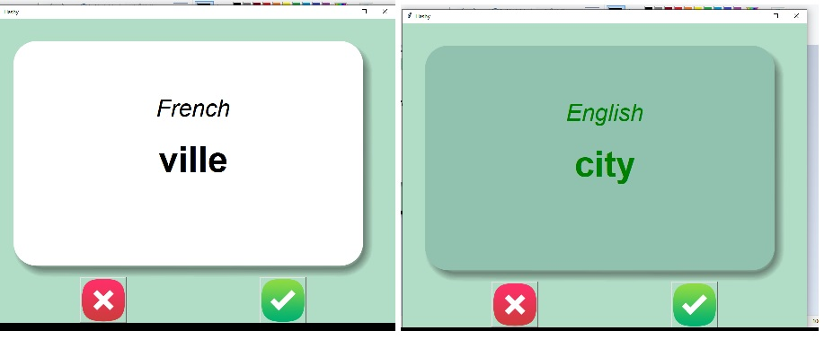

# 🇫🇷 Flashy – French Vocabulary Flashcard App

**Flashy** is a fun and interactive flashcard app built with Python's Tkinter GUI library. It helps users learn French vocabulary with a flip-card interface that reveals English meanings after a short delay. Users can track their learning progress and eliminate known words from future practice.

---

## 🖼️ App Preview



---

## 🚀 Features

- 🧠 Auto-flip flashcards to reveal the English translation after 3 seconds.
- ✅ Click a button to mark a word as "known" and remove it from the practice list.
- 💾 Progress is saved between sessions using CSV files.
- 🎨 Clean and intuitive UI with custom card graphics.

---

## 📁 File Structure

```
FlashCard_project/
│
├── main.py                # Main Python script
├── french_words.csv       # Full French-English word list
├── words_to_learn.csv     # Updated dynamically based on user progress
├── card_front.png         # Front card image (white)
├── card_back.png          # Back card image (green)
├── right.png              # Tick image for 'known'
├── wrong.png              # Cross image for 'unknown'
├── screenshot.jpg           # App screenshot (used in README)
└── README.md              # This file
```

---

## 🛠️ Requirements

Make sure you have:

- Python 3.x installed
- `pandas` library installed (install via `pip install pandas`)
- Image files in the same directory as `main.py`

---

## ▶️ How to Run
Clone the repository:
   ```bash
   git clone https://github.com/nex-creator/python_projects.git
   cd python_projects

2. Install the required package:
   ```bash
   pip install pandas
   ```

3. Run the app:
   ```bash
   python main.py
   ```

---

## 🧠 How It Works

- App first checks if `words_to_learn.csv` exists.
- If not, it loads `french_words.csv` (the full set).
- A French word appears → 3s delay → card flips to show the English word.
- You can:
  - ❌ Click red cross to skip to the next card.
  - ✅ Click green tick to mark the word as known.
- Known words are removed from the list and saved to `words_to_learn.csv`.

---

## 🛣️ Future Enhancements

- Add support for other languages (Spanish, German, etc.)
- Add audio pronunciation with `gTTS` or `pyttsx3`
- Add spaced repetition algorithm

---

## 👩‍💻 Author

Built by Neha Sharma as a personal learning project.

---

## 📸 Screenshot Attribution

Preview screenshot included in `screenshot.jpg`. 